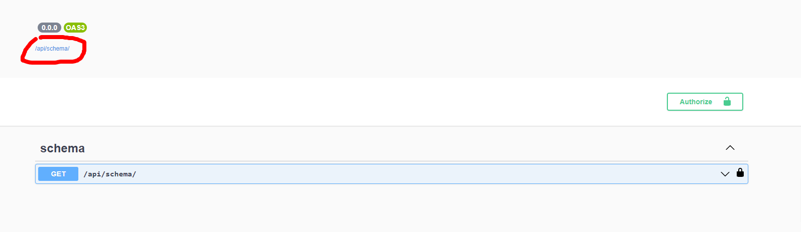

# [API Documentation](https://drf-spectacular.readthedocs.io/en/latest/readme.html)

- Learn API API Documentation
- Implemented Swaggar and OpenAPI Schema
- Tested Documentation

Django REST framework - DRF spectacular: `drf-spectacular` is a `OpenAPI 3` schema generation tool for Django REST framework.
It Goals: - Extract as much schema information from DRF as possible. - Provide flexibility to make the schema usable in the real world - Generate a schema that works well with the most popular client generators.

Install `drf-spectacular` to `requirements.txt`

```python
  drf-spectacular>=0.15.1,<0.16
```

- run: `docker-compose build`

then add `drf-spectacular` to installed apps in `settings.py`

```python
INSTALLED_APPS = [

    # ALL YOUR APPS
    'rest_framework',
    'drf_spectacular',
]
```

and finally register our spectacular AutoSchema with DRF in `settings.py`.

```python
REST_FRAMEWORK = {
    'DEFAULT_SCHEMA_CLASS': 'drf_spectacular.openapi.AutoSchema',
}
```

##### [Configure URLs](https://drf-spectacular.readthedocs.io/en/latest/readme.html#take-it-for-a-spin)

Add below lines to `app/app/urls.py`:

```python
from drf_spectacular.views import (
    SpectacularAPIView,
    SpectacularSwaggerView,
)

from django.contrib import admin
from django.urls import path

urlpatterns = [
    path('admin/', admin.site.urls),

    # for Api Url
    path('api/schema/', SpectacularAPIView.as_view(), name='api-schema'),
    path(
        'api/docs/',
        SpectacularSwaggerView.as_view(url_name='api-schema'),
        name='api-docs',
    )
]
```

Final Steps to Run:

- `docker-compose build`
- `docker-compose up`
- visit: `127.0.0.1:8000/api/docs` then click `/api/schema/` to download `schema.yaml` file
  
- open `schema.yaml` file
