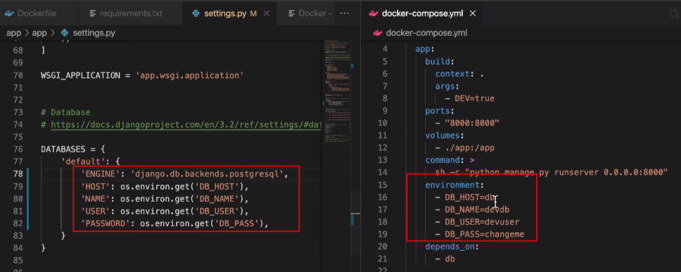
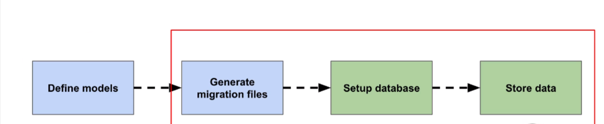

## Add database service:

Add below code to `docker-compose.yml`:

```python

    command: >
      sh -c "python manage.py runserver 0.0.0.0:8000"

    environment:
      - DB_HOST=db
      - DB_NAME=devdb
      - DB_USER=devuser
      - DB_PASS=changeme
    depends_on:
      - db

  db:
    image: postgres:15-alpine
    volumes:
      - dev-db-data:/var/lib/postgresql/data
    environment:
      - POSTGRES_DB=devdb
      - POSTGRES_USER=devuser
      - POSTGRES_PASSWORD=changeme

volumes:
  dev-db-data:
```

- run: `docker-composer up`

## Database configuration with Django

Few Steps:update

- Step-1: `Dockerfile`- add few packages
- Step-2: `requirments.txt`
- Step-3: `settings.py`

#### Step-1:

`Psycopg 3:` it is a newly designed PostgreSQL database adapter for the Python.
Few package are required for python alpine:
  * postgresql-clint
  * build base
  * postgresql-dev
  * must-dev

Add few lines to `Dockerfile:`

```python
ARG DEV=false
RUN python -m venv /py && \
    /py/bin/pip install --upgrade pip && \
    apk add --update --no-cache postgresql-client && \
    apk add --update --no-cache --virtual .tmp-build-deps \
        build-base postgresql-dev musl-dev && \
    /py/bin/pip install -r /tmp/requirements.txt && \
    if [ $DEV = "true" ]; \
        then /py/bin/pip install -r /tmp/requirements.dev.txt ; \
    fi && \
    rm -rf /tmp && \
    apk del .tmp-build-deps && \
    adduser \
```

#### Step-2: add `Psycopg` to `requirments.txt`

```python
psycopg2>=2.8.6,<2.9
```

- to clear our containers run:
  `docker-compose down`

- to rebuild our container:
  `docker-compose build`

#### Step 3: Configure `settings.py`

```python
# add `import os` on the top:
import os
DATABASES = {
    'default': {
        'ENGINE': 'django.db.backends.postgresql',
        'HOST': os.environ.get('DB_HOST'),
        'NAME': os.environ.get('DB_NAME'),
        'USER': os.environ.get('DB_USER'),
        'PASSWORD': os.environ.get('DB_PASS'),
    }
}
```

###### Example:



- remove `db.sqlite3` from project's app folder.

#### Create core app:

Create a new app:
`docker-compose run --rm app sh -c "python manage.py startapp core"`

- remove `tests.py` from core folder, then create a folder called `tests` then create tests related files:

  - `__init__.py`
  - tests files\*\*

- go to `settings.py` and add core

```
INSTALLED_APPS = [
    'core',
]
```

############################################################################################

### Write tests for wait_for_db command

1. Create a file `core/management/commands/wait_for_db.py`
2. Add `core/management/commands/__init__.py` in the folders management and commands.

`wait_for_db.py:`

```python
"""
Django command to wait for the database to be available.
"""
import time

from psycopg2 import OperationalError as Psycopg2OpError

from django.db.utils import OperationalError
from django.core.management.base import BaseCommand


class Command(BaseCommand):
    """Django command to wait for database."""

    def handle(self, *args, **options):
        pass
        """Entrypoint for command."""
        self.stdout.write('Waiting for database...')
        db_up = False
        while db_up is False:
            try:
                self.check(databases=['default'])
                db_up = True
            except (Psycopg2OpError, OperationalError):
                self.stdout.write('Database unavailable, waiting 1 second...')
                time.sleep(1)

        self.stdout.write(self.style.SUCCESS('Database available!'))
```

3. Create a file `core/tests/test_commands.py`:

```python
"""
Test custom Django management commands.
"""
from unittest.mock import patch

from psycopg2 import OperationalError as Psycopg2OpError

from django.core.management import call_command
from django.db.utils import OperationalError
from django.test import SimpleTestCase


@patch('core.management.commands.wait_for_db.Command.check')
class CommandTests(SimpleTestCase):
    """Test commands."""

    def test_wait_for_db_ready(self, patched_check):
        """Test waiting for database if database ready."""
        patched_check.return_value = True

        call_command('wait_for_db')

        patched_check.assert_called_once_with(databases=['default'])

    @patch('time.sleep')
    def test_wait_for_db_delay(self, patched_sleep, patched_check):
        """Test waiting for database when getting OperationalError."""
        patched_check.side_effect = [Psycopg2OpError] * 2 + \
            [OperationalError] * 3 + [True]

        call_command('wait_for_db')

        self.assertEqual(patched_check.call_count, 6)
        patched_check.assert_called_with(databases=['default'])
```

4. update `app/core/admin.py`:
   `from django.contrib import admin  # noqa`

5. update `app/core/models.py`:
   `from django.db import models  # noqa`

6. run few commeands:
   - `docker-compose run --rm app sh -c "python manage.py test"`
   - `docker-compose run --rm app sh -c "python manage.py wait_for_db"`
   - `docker-compose run --rm app sh -c "python manage.py test & flake8"`

######################################################################################################

#### Database Migrations

Using the ORM:


To work with migration, update `.github/workflows/checks.yml` and `docker-compose.yml`

Add below lines to `.github/workflows/checks.yml`:

```python
     uses: actions/checkout@v2
      - name: Test
        run: docker-compose run --rm app sh -c "python manage.py wait_for_db && python manage.py test"
      - name: Lint
        run: docker-compose run --rm app sh -c "flake8"
```

`docker-compose.yml`:

```python
    volumes:
      - ./app:/app
    command: >
      sh -c "python manage.py wait_for_db &&
             python manage.py migrate &&
             python manage.py runserver 0.0.0.0:8000"

    environment:
      - DB_HOST=db
      - DB_NAME=devdb
      - DB_USER=devuser
      - DB_PASS=changeme
```
#### Run: 
  * `docker-compose down`
  * `docker-compose up`

upload to git & check github action


